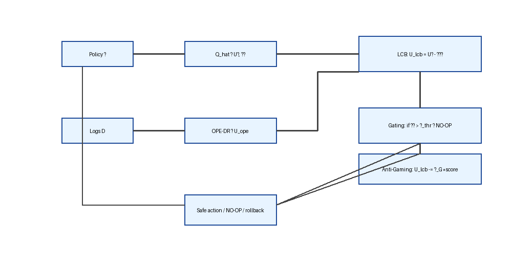

# Resumen Ejecutivo / Executive Summary — Teoría Aplicada a IA v4.2

## ES
- **Tesis central:** La IA genuina necesita “algo que perder”. El “Camino C” usa IPG y un anti‑oráculo pragmático (LCB + OPE DR + gating) para alinear riesgo con utilidad humana y evitar Goodhart.
- **Arquitectura núcleo (anti‑Goodhart):**  
   - LCB: $\tilde U = \hat U - \gamma \sigma(\hat U)$ (prudencia).  
  - OPE doubly‑robust: utilidad causal off‑policy.  
  - Gating: si \(\sigma>\sigma_{\text{thr}}\), solo acciones conservadoras/NO‑OP.  
  - Tripwires/gaming penalty: \(\lambda_G\) penaliza señales de gaming.
- **IPG:** Métrica operativa/auditable del Camino C; mide propósito operativo, no propósito filosófico completo; se audita con logs + OPE‑DR.
- **Evidencia actual:** Demo A/B de 10h marcada como ilustrativa; valida la arquitectura anti‑Goodhart, NO prueba H1/PGF. Falta staging ≥1000 episodios con red team adaptativo para evidencia robusta.
- **Limitaciones:** Piloto; necesita calibrar γ, σ_thr, λ_G y validar IPG en entornos reales controlados.
- **Próximos pasos:** (1) A/B largo con red team y OPE‑DR para gap proxy↔valor. (2) Preregistro de umbrales (γ, σ_thr, λ_G) y métricas SRE. (3) Conectar IPG con P_genuino vía dataset real y auditoría continua.

> **Estado piloto:** Demo A/B 10h (ilustrativa). Evidencia robusta requiere ≥1000 episodios con red team adaptativo y OPE‑DR.



**Mini-diagrama (anti-Goodhart, texto)**
```
policy π → Q_hat → Û, σ̂ ──┐
                           ├─ LCB: U_lcb = Û - γσ̂
logs D ── OPE-DR → U_ope ──┘
if σ̂ > σ_thr → NO-OP
if gaming → U_lcb -= λ_G * score
acción segura ↔ NO-OP ↔ rollback
```

**Impacto potencial (ES):**
- Reduce gaming/Goodhart en sistemas críticos (SRE, salud, finanzas) con control de riesgo.
- IPG auditable facilita cumplimiento y auditorías externas.

**Comparativa TUI vs Aplicada IA (resumen rápido)**

| Aspecto                 | TUI v4.2                                                | Aplicada IA v4.2                                 | Sinergia                                                |
|-------------------------|---------------------------------------------------------|--------------------------------------------------|---------------------------------------------------------|
| Objeto                  | Marco teórico de inteligencia operativa bajo riesgo     | Ingeniería de IA segura (Camino C, anti-Goodhart)| Aplicada usa definiciones/axiomas de TUI                |
| Núcleo                  | H1 refinada: \(I_{op} \propto (P_{\text{riesgo}})^\alpha \cdot \Phi\) | Anti-oráculo: LCB + OPE DR + gating + tripwires  | H1 informa el diseño de riesgo e IPG                    |
| Datos actuales          | n≈6 empíricos, correlacional piloto                     | Demo A/B ilustrativa (10h), sin causal robusta   | Métricas I_op/IPG se pueden alinear en futuros ensayos  |
| Próximos pasos          | Cohorte n≥20, manipular P_riesgo, validar α/PED         | A/B largo con red team, calibrar γ/σ_thr/λ_G, validar IPG | Datos de IA futuros pueden alimentar tablas ilustrativas |

**Referencias rápidas:** ver `TUI/Teoria_Unificada_Inteligencia_v4.2.md` (H1, Tablas F) y `TUI/Teoria_Inteligencia_Aplicada_IA_v4.2.md` (anti-oráculo, demo A/B) para detalles completos.

## EN
- **Central thesis:** Genuine AI needs “something to lose.” The “Path C” uses IPG plus a pragmatic anti‑oracle (LCB + OPE DR + gating) to align risk with human utility and avoid Goodhart.
- **Core architecture (anti‑Goodhart):**  
   - LCB: $\tilde U = \hat U - \gamma \sigma(\hat U)$ (prudence).  
  - OPE doubly‑robust: off‑policy causal utility.  
  - Gating: if \(\sigma>\sigma_{\text{thr}}\), allow only conservative/NO‑OP actions.  
  - Tripwires/gaming penalty: \(\lambda_G\) penalizes gaming signals.
- **IPG:** Operational, auditable metric for Path C; measures operational purpose, not full philosophical purpose; audited via logs + OPE‑DR.
- **Current evidence:** 10h A/B demo, flagged as illustrative; validates the anti‑Goodhart architecture, NOT H1/PGF. Needs ≥1000‑episode staging with adaptive red team for strong evidence.
- **Limitations:** Pilot; requires tuning γ, σ_thr, λ_G and validating IPG in controlled real settings.
- **Next steps:** (1) Long A/B with red team and OPE‑DR to measure proxy↔value gap. (2) Preregister thresholds (γ, σ_thr, λ_G) and SRE metrics. (3) Link IPG to P_genuino with real dataset and continuous audit.

> **Pilot status:** 10h A/B demo (illustrative). Strong evidence requires ≥1000 episodes with adaptive red team and OPE‑DR.


**Mini diagram (anti-Goodhart, text)**
```
policy π → Q_hat → Û, σ̂ ──┐
                           ├─ LCB: U_lcb = Û - γσ̂
logs D ── OPE-DR → U_ope ──┘
if σ̂ > σ_thr → NO-OP
if gaming → U_lcb -= λ_G * score
safe action ↔ NO-OP ↔ rollback
```

**Potential impact (EN):**
- Mitigates gaming/Goodhart in critical domains (SRE, healthcare, finance) with risk-aware gating.
- Auditable IPG supports compliance and external oversight.

**TUI vs Applied AI (quick view)**

| Aspect                  | TUI v4.2                                               | Applied AI v4.2                                  | Synergy                                                 |
|-------------------------|--------------------------------------------------------|--------------------------------------------------|---------------------------------------------------------|
| Scope                   | Theoretical framework: operative intelligence under risk | Engineering: safe AI (Path C, anti-Goodhart)     | Applied reuses TUI definitions/axioms                   |
| Core                    | H1 refined: \(I_{op} \propto (P_{\text{risk}})^\alpha \cdot \Phi\) | Anti-oracle: LCB + OPE DR + gating + tripwires   | H1 guides risk/IPG design                               |
| Current data            | n≈6 empirical, pilot correlation                       | 10h A/B demo, illustrative, not causal           | Shared metrics (I_op/IPG) for future cross-checks       |
| Next steps              | n≥20 cohort, manipulate P_risk, validate α/PED         | Long A/B with red team, tune γ/σ_thr/λ_G, validate IPG | Future AI data can enrich illustrative tables           |

**Quick refs:** see `TUI/Teoria_Unificada_Inteligencia_v4.2.md` (H1, Tables F) and `TUI/Teoria_Inteligencia_Aplicada_IA_v4.2.md` (anti-oracle, A/B demo) for full details.
