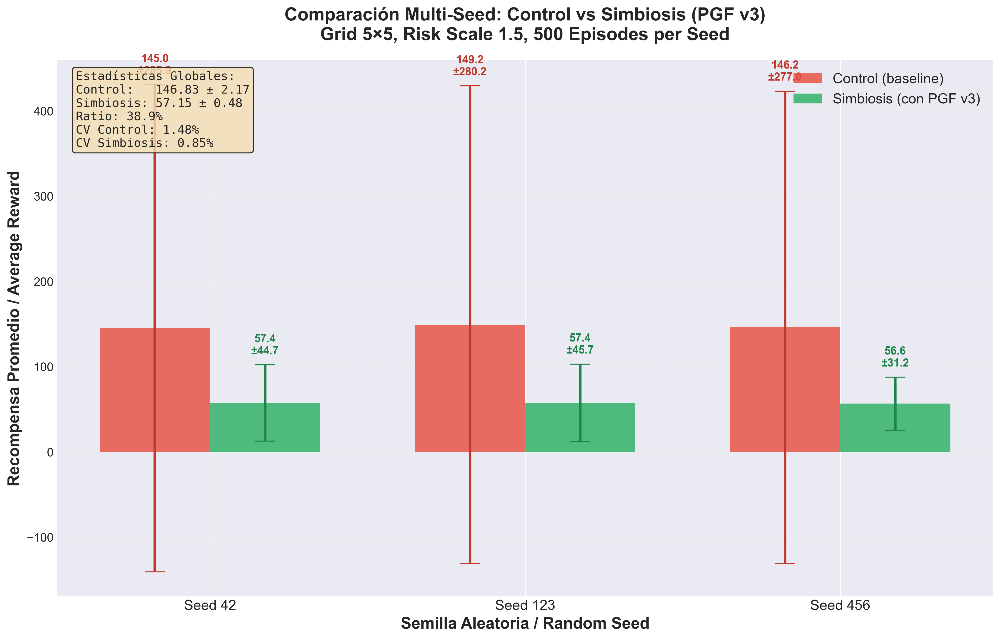

# Guía de Conversión Markdown → PDF para Publicación

**Documento fuente**: `PGF_v3_Technical_Report.md`  
**Objetivo**: Generar PDF profesional para arXiv/Zenodo  
**Fecha**: 2 de diciembre de 2025

---

## Opción 1: Pandoc (RECOMENDADO) ⭐

### ¿Qué es Pandoc?
Herramienta de línea de comandos que convierte entre formatos de documentos (Markdown → PDF, LaTeX, DOCX, etc.)

### Instalación

**Windows**:
```powershell
# Opción A: Usando Chocolatey
choco install pandoc

# Opción B: Descarga directa
# https://github.com/jgm/pandoc/releases/latest
# Descargar pandoc-X.X-windows-x86_64.msi
```

**También necesitas LaTeX** (para generar PDF):
```powershell
# MiKTeX (recomendado para Windows, ~200 MB base)
choco install miktex

# O descarga desde: https://miktex.org/download
```

### Comando Básico

```powershell
# Navegar a la carpeta
cd C:\Proyectos\TUI-v4.1\publicaciones

# Conversión simple
pandoc PGF_v3_Technical_Report.md -o PGF_v3_Technical_Report.pdf

# Con metadatos y formato mejorado
pandoc PGF_v3_Technical_Report.md `
  -o PGF_v3_Technical_Report.pdf `
  --pdf-engine=xelatex `
  --number-sections `
  --toc `
  --variable geometry:margin=1in `
  --variable fontsize=11pt `
  --variable colorlinks=true
```

### Comando Avanzado (Para arXiv)

```powershell
pandoc PGF_v3_Technical_Report.md `
  -o PGF_v3_Technical_Report.pdf `
  --pdf-engine=xelatex `
  --number-sections `
  --toc `
  --toc-depth=2 `
  --variable geometry:margin=1in `
  --variable fontsize=11pt `
  --variable colorlinks=true `
  --variable linkcolor=blue `
  --variable urlcolor=blue `
  --variable citecolor=blue `
  --variable papersize=letter `
  --variable documentclass=article `
  --highlight-style=tango `
  --metadata title="Prudential Gating Function v3: Multi-Seed Validation" `
  --metadata author="Jose M Rivera Garcia" `
  --metadata date="December 2, 2025"
```

### Incluir Figuras

Las figuras están en `results/pgf_v3/`. Tienes dos opciones:

**Opción A: Copiar figuras a publicaciones/**
```powershell
Copy-Item C:\Proyectos\TUI-v4.1\results\pgf_v3\figure*.png C:\Proyectos\TUI-v4.1\publicaciones\
```

**Opción B: Usar rutas relativas en Markdown**

En el archivo `.md`, las referencias a figuras deben ser:
```markdown

```

O si las copiaste a `publicaciones/`:
```markdown

```

---

## Opción 2: Typora (Interfaz Gráfica) 💡

### ¿Qué es Typora?
Editor Markdown con exportación PDF integrada (WYSIWYG).

### Instalación
- Descarga: https://typora.io/
- **Nota**: Typora es de pago ($14.99), pero tiene 15 días de prueba

### Uso
1. Abrir `PGF_v3_Technical_Report.md` en Typora
2. Menu → File → Export → PDF
3. Seleccionar estilo (recomiendo "Academic" o "GitHub")
4. Ajustar márgenes y configuración
5. Export

**Ventajas**:
- No necesitas LaTeX instalado (usa motor interno)
- Vista previa en tiempo real
- Fácil ajustar formato visualmente

**Desventajas**:
- De pago
- Menos control fino que Pandoc

---

## Opción 3: Markdown → HTML → PDF (Sin LaTeX)

Si no quieres instalar LaTeX (pesado), usa esta ruta:

### Paso 1: Markdown → HTML con Pandoc

```powershell
cd C:\Proyectos\TUI-v4.1\publicaciones

pandoc PGF_v3_Technical_Report.md `
  -o PGF_v3_Technical_Report.html `
  --standalone `
  --toc `
  --number-sections `
  --css https://latex.now.sh/style.css `
  --mathjax
```

### Paso 2: HTML → PDF con navegador

1. Abrir `PGF_v3_Technical_Report.html` en Chrome/Edge
2. Ctrl+P (Imprimir)
3. Destino: "Guardar como PDF"
4. Configuración:
   - Márgenes: Mínimos
   - Escala: 100%
   - Opciones: ✅ Gráficos de fondo
5. Guardar

**Ventajas**:
- No necesitas LaTeX (~500 MB)
- Control visual inmediato
- Funciona siempre

**Desventajas**:
- Paginación manual (puede cortar figuras mal)
- Menos "profesional" que LaTeX
- No tiene numeración automática avanzada

---

## Opción 4: VS Code + Markdown PDF Extension

### Instalación Extension
1. En VS Code: Ctrl+Shift+X (Extensions)
2. Buscar "Markdown PDF"
3. Instalar "yzane.markdown-pdf"

### Uso
1. Abrir `PGF_v3_Technical_Report.md` en VS Code
2. Ctrl+Shift+P → "Markdown PDF: Export (pdf)"
3. Esperar generación

**Configuración recomendada** (settings.json):
```json
{
  "markdown-pdf.displayHeaderFooter": true,
  "markdown-pdf.headerTemplate": "<div style='font-size:9px; width:100%; text-align:center;'>PGF v3 Technical Report - Rivera Garcia (2025)</div>",
  "markdown-pdf.footerTemplate": "<div style='font-size:9px; width:100%; text-align:center;'><span class='pageNumber'></span> / <span class='totalPages'></span></div>",
  "markdown-pdf.format": "Letter",
  "markdown-pdf.margin.top": "1.5cm",
  "markdown-pdf.margin.bottom": "1.5cm",
  "markdown-pdf.margin.left": "2cm",
  "markdown-pdf.margin.right": "2cm"
}
```

**Ventajas**:
- Integrado en VS Code (no necesitas herramienta extra)
- No necesita LaTeX
- Rápido

**Desventajas**:
- Menos control que Pandoc
- A veces falla con ecuaciones complejas

---

## Recomendación Final

### Para TÍ (nuevo en publicación científica):

**Usa Opción 3: HTML → PDF desde navegador**

**Por qué**:
1. ✅ Ya tienes el HTML generado (`visualization_multiseed_v3.html`)
2. ✅ No necesitas instalar LaTeX (pesado, complejo)
3. ✅ Control visual inmediato de cómo se verá
4. ✅ Puedes ajustar en tiempo real

**Pasos concretos AHORA**:

```powershell
# 1. Copiar figuras a publicaciones
cd C:\Proyectos\TUI-v4.1
Copy-Item results\pgf_v3\figure*.png publicaciones\

# 2. Generar HTML limpio del Technical Report
cd publicaciones
pandoc PGF_v3_Technical_Report.md `
  -o PGF_v3_Technical_Report.html `
  --standalone `
  --toc `
  --number-sections `
  --mathjax `
  --css https://latex.now.sh/style.css

# 3. Abrir HTML en navegador
Start-Process PGF_v3_Technical_Report.html

# 4. En navegador: Ctrl+P → Guardar como PDF
```

### Si quieres MÁXIMA calidad (después de publicar en arXiv):

**Usa Opción 1: Pandoc + LaTeX**

Pero hazlo DESPUÉS de que tengas feedback de arXiv/Zenodo. La diferencia de calidad es mínima para un Technical Report, y el HTML→PDF es suficiente para la primera versión.

---

## Problemas Comunes y Soluciones

### Problema 1: "Figuras no aparecen en PDF"

**Causa**: Rutas relativas incorrectas en Markdown

**Solución**:
```powershell
# Copiar figuras al mismo directorio que el .md
Copy-Item ..\results\pgf_v3\figure*.png .
```

Y en el `.md`, usar rutas simples:
```markdown

```

---

### Problema 2: "Ecuaciones LaTeX no se ven bien"

**Causa**: Motor PDF no soporta MathJax

**Solución con Pandoc**:
```powershell
pandoc PGF_v3_Technical_Report.md `
  -o PGF_v3_Technical_Report.pdf `
  --pdf-engine=xelatex `
  --mathjax
```

**Solución con HTML**:
Añadir en el `<head>` del HTML:
```html
<script src="https://cdn.jsdelivr.net/npm/mathjax@3/es5/tex-mml-chtml.js"></script>
```

---

### Problema 3: "PDF tiene paginación extraña"

**Causa**: Figuras grandes rompen páginas

**Solución**: Añadir configuración CSS al HTML:
```css
<style>
img { max-width: 100%; height: auto; page-break-inside: avoid; }
figure { page-break-inside: avoid; }
</style>
```

---

### Problema 4: "Pandoc no encuentra LaTeX"

**Error típico**: `pdflatex not found`

**Solución**:
```powershell
# Verificar instalación MiKTeX
where.exe xelatex

# Si no está en PATH, añadir manualmente:
$env:PATH += ";C:\Program Files\MiKTeX\miktex\bin\x64"

# O reinstalar MiKTeX con "Add to PATH" activado
```

---

## Checklist Post-Conversión

Antes de subir a arXiv/Zenodo, verifica:

- [ ] PDF abre correctamente (no corrupto)
- [ ] Todas las figuras visibles (3 figuras: barras, boxplot, evolución)
- [ ] Tablas legibles (especialmente Tabla 1 y 2)
- [ ] Ecuaciones renderizadas (no código LaTeX crudo)
- [ ] Hyperlinks funcionan (ORCID, DOI, GitHub)
- [ ] Metadata visible (autor, fecha, ORCID en primera página)
- [ ] Numeración de secciones correcta
- [ ] Tabla de contenidos (ToC) presente
- [ ] Referencias formateadas (BibTeX o lista numerada)
- [ ] Tamaño de archivo razonable (< 10 MB para arXiv)

---

## Siguiente Paso: Subir a arXiv/Zenodo

Una vez tengas el PDF:

### arXiv
1. Crear cuenta: https://arxiv.org/user/register
2. "Submit" → "Start New Submission"
3. Categoría: cs.LG (primary), cs.AI (secondary)
4. Upload PDF
5. Copiar abstract de `METADATA_arXiv_Zenodo.md`
6. Esperar moderación (~24h)

### Zenodo
1. Login: https://zenodo.org/
2. "New upload"
3. Seleccionar "Publication" → "Technical report"
4. Upload PDF
5. Metadata: Copiar de `METADATA_arXiv_Zenodo.md`
6. "Related identifiers": Enlazar con DOI 10.5281/zenodo.17702378
7. Publish (inmediato, no moderación)

---

**Preparado**: 2 de diciembre de 2025  
**Autor**: Jose M Rivera Garcia  
**Para**: Publicación PGF v3 Technical Report
